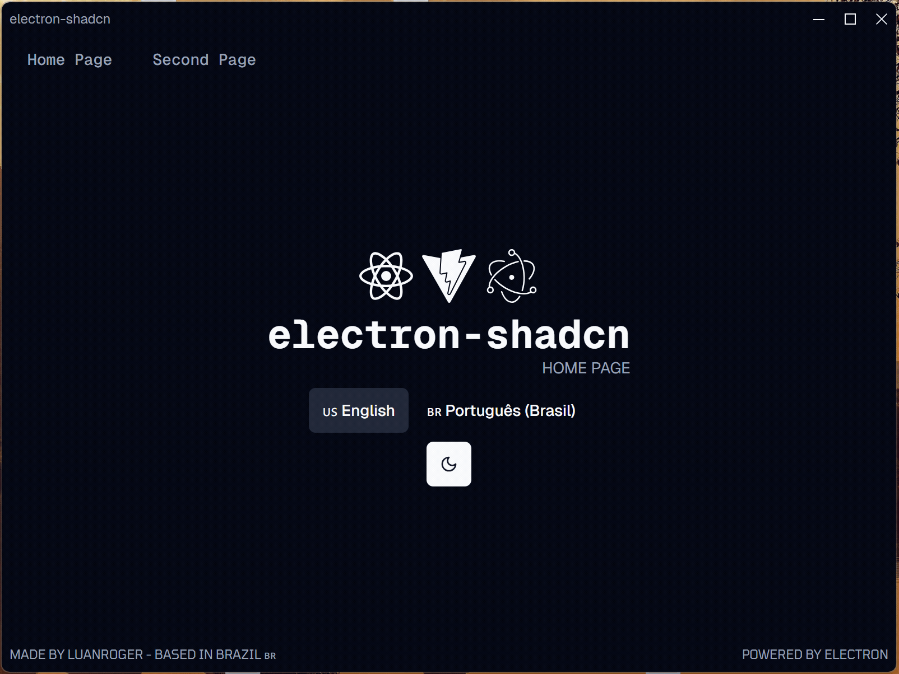

# RushMeme

RushMeme is a free and open-source desktop tool for crypto research and trading workflows. Select a contract address, press a global shortcut, and open it across your chosen platforms instantly. It stays available from the system tray or menu bar when the main window is closed.

All features are included for everyone: no account, payment, license key, or feature tier is required.



## Features

- Open a selected contract address in multiple configured platforms with one shortcut.
- Run from the system tray or menu bar with per-platform actions.
- Persist platform settings and language preferences locally.
- Create custom platforms, URL templates, chains, and shortcuts.
- Correct EVM chains locally with your own Alchemy API key.
- Support macOS and Windows.

## Network and privacy

RushMeme has no account, licensing, payment, telemetry, or application backend.
Normal shortcut execution opens only the platform URLs you configure. Smart chain
correction is optional: when enabled, the desktop app sends the selected contract
address directly to supported Alchemy RPC endpoints using the API key you provide.
The key is stored in the app's local settings and is never sent to RushMeme.

The update checker reads the latest public release from GitHub Releases. Disabling
smart chain correction leaves platform navigation and update checks as the only
network activity initiated by RushMeme itself.

## Getting started

```bash
git clone https://github.com/tankxu/rushmeme.git
cd rushmeme
npm install
npm run start
```

Run checks with `npm run lint` and `npm run test`. Create platform distributables with `npm run make`.

## Libs and tools

To develop a Electron app, you probably will need some UI, test, formatter, style or other kind of library or framework, so let me install and configure some of them to you.

### Core 🏍️

- [Electron 38](https://www.electronjs.org)
- [Vite 7](https://vitejs.dev)

### DX 🛠️

- [TypeScript 5.9](https://www.typescriptlang.org)
- [Prettier](https://prettier.io)
- [ESLint 9](https://eslint.org)
- [Zod 4](https://zod.dev)
- [React Query (TanStack)](https://react-query.tanstack.com)

### UI 🎨

- [React 19](https://reactjs.org)
- [Tailwind 4](https://tailwindcss.com)
- [Shadcn UI](https://ui.shadcn.com)
- [Geist](https://vercel.com/font) as default font
- [i18next](https://www.i18next.com)
- [TanStack Router](https://tanstack.com/router) (with file based routing)
- [Lucide](https://lucide.dev)

### Test 🧪

- [Vitest](https://vitest.dev)
- [Playwright](https://playwright.dev)
- [React Testing Library](https://testing-library.com/docs/react-testing-library/intro)

### Packing and distribution 📦

- [Electron Forge](https://www.electronforge.io)

### CI/CD 🚀

- Pre-configured [GitHub Actions workflow](https://github.com/LuanRoger/electron-shadcn/blob/main/.github/workflows/playwright.yml), for test with Playwright

### Project preferences 🎯

- Use Context isolation
- [React Compiler](https://react.dev/learn/react-compiler) is enabled by default.
- `titleBarStyle`: hidden (Using custom title bar)
- Geist as default font
- Some default styles was applied, check the [`styles`](https://github.com/LuanRoger/electron-shadcn/tree/main/src/styles) directory
- React DevTools are installed by default

## Directory structure

```plaintext
.
└── ./src/
    ├── ./src/assets/
    │   └── ./src/assets/fonts/
    ├── ./src/components/
    │   ├── ./src/components/template
    │   └── ./src/components/ui/
    ├── ./src/helpers/
    │   └── ./src/helpers/ipc/
    ├── ./src/layout/
    ├── ./src/lib/
    ├── ./src/pages/
    ├── ./src/style/
    └── ./src/tests/
```

- `src/`: Main directory
  - `assets/`: Store assets like images, fonts, etc.
  - `components/`: Store UI components
    - `template/`: Store the all not important components used by the template. It doesn't include the `WindowRegion` or the theme toggler, if you want to start an empty project, you can safely delete this directory.
    - `ui/`: Store Shadcn UI components (this is the default direcotry used by Shadcn UI)
  - `helpers/`: Store IPC related functions to be called in the renderer process
    - `ipc/`: Directory to store IPC context and listener functions
      - Some implementations are already done, like `theme` and `window` for the custom title bar
  - `layout/`: Directory to store layout components
  - `lib/`: Store libraries and other utilities
  - `pages/`: Store app's pages
  - `style/`: Store global styles
  - `tests/`: Store tests (from Vitest and Playwright)

## NPM script

To run any of those scripts:

```bash
npm run <script>
```

- `start`: Start the app in development mode
- `package`: Package your application into a platform-specific executable bundle and put the result in a folder.
- `make`: Generate platform-specific distributables (e.g. .exe, .dmg, etc) of your application for distribution.
- `publish`: Electron Forge's way of taking the artifacts generated by the `make` command and sending them to a service somewhere for you to distribute or use as updates.
- `lint`: Run ESLint to lint the code
- `format`: Run Prettier to check the code (it doesn't change the code)
- `format:write`: Run Prettier to format the code
- `test`: Run the default unit-test script (Vitest)
- `test:watch`: Run the default unit-test script in watch mode (Vitest)
- `test:unit`: Run the Vitest tests
- `test:e2e`: Run the Playwright tests
- `test:all`: Run all tests (Vitest and Playwright)

> The test scripts involving Playwright require the app be builded before running the tests. So, before run the tests, run the `package`, `make` or `publish` script.

## License

Released under the [MIT License](LICENSE).
